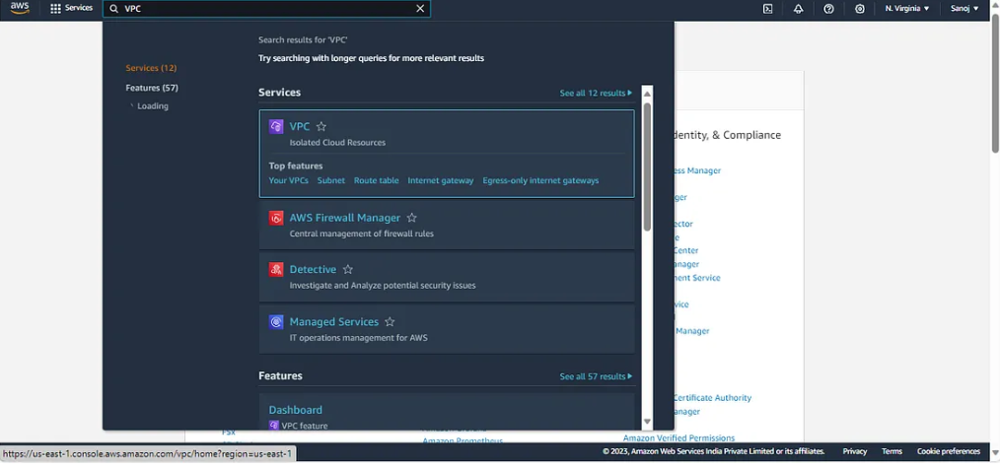

# 🌐VPC Network Deployment

## 📌 Project Overview
This project demonstrates the creation of a Virtual Private Cloud (VPC) using Amazon Web Services.  
It includes subnet configuration, routing, internet connectivity, and DNS setup.

---

## 🏗️ Architecture Diagram

  

---

## ⚙️ Implementation Steps

## 🔹 Step 1: Create VPC
Created a Virtual Private Cloud (VPC) with a defined CIDR block to establish an isolated network.  
This forms the foundation for deploying all cloud resources securely.
.

  

---

## 🔹 Step 2: Configure VPC Setup
Configured VPC settings and completed the initialization process.  
Ensured proper IP range allocation and successful VPC creation.

  

  

---

## 🔹 Step 3: Create Subnets
Created subnets within the VPC to divide the network into smaller sections.  
This improves organization and allows better control over resources.

  

  

---

## 🔹 Step 4: Configure Route Table
Created and configured route tables to manage network traffic flow.  
Defined rules for internal and external communication.

  

  

---

## 🔹 Step 5: Create & Attach Internet Gateway
Created an Internet Gateway and attached it to the VPC.  
This enables communication between the VPC and the internet.

  

  

---

## 🔹 Step 6: Configure Public IP
Enabled automatic public IP assignment for subnet resources.  
This allows instances to be accessed from the internet.

  

  

---

## 🔹 Step 7: Enable DNS Settings
Enabled DNS resolution and hostname support in the VPC.  
This allows communication using domain names instead of IP addresses.

  

  

---

## ✅ Final Output
- Successfully created a VPC  
- Configured subnets and routing  
- Enabled internet access using Internet Gateway  
- Verified DNS and network settings  

---

## 🛠️ Tech Stack
- Amazon Web Services (AWS)  
- VPC, Subnets, Route Tables  
- Internet Gateway  

---

## 📊 Skills Demonstrated
- Cloud Networking  
- AWS Infrastructure Setup  
- Network Configuration & Security  

---

